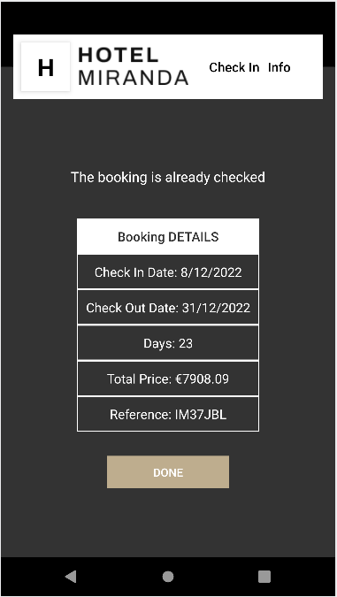

# Hotel Miranda React Native #

Miranda hotel website with React Native.

## Installation ##

- Clone this repository.

```bash
git clone https://github.com/JoseFerAlvarez/hotel-miranda-laravel.git
```

- Install the .apk file on your system.

## Technologies used ##

<p align="center">


</p>

## Web View ##

<p align="center">

</p>
